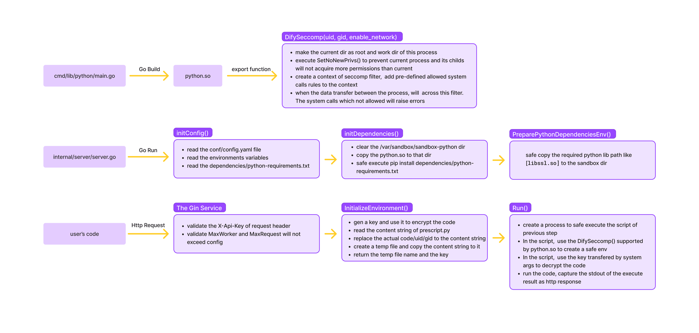

# Dify-Sandbox
## Introduction
Dify-Sandbox offers a simple way to run untrusted code in a secure environment. It is designed to be used in a multi-tenant environment, where multiple users can submit code to be executed. The code is executed in a sandboxed environment, which restricts the resources and system calls that the code can access.

## Use
### Requirements
DifySandbox currently only supports Linux, as it's designed for docker containers. It requires the following dependencies:
- libseccomp
- pkg-config
- gcc
- golang 1.20.6

### Steps
1. Clone the repository using `git clone https://github.com/langgenius/dify-sandbox` and navigate to the project directory.
2. Run ./install.sh to install the necessary dependencies.
3. Run ./build/build_[amd64|arm64].sh to build the sandbox binary.
4. Run ./main to start the server.

If you want to debug the server, firstly use build script to build the sandbox library binaries, then debug as you want with your IDE.

## FAQ

Refer to the [FAQ document](FAQ.md)

## Workflow
