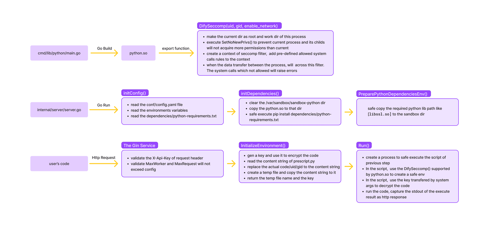

# Dify-Sandbox
## Introduction
Dify-Sandbox offers a simple way to run untrusted code in a secure environment. It is designed to be used in a multi-tenant environment, where multiple users can submit code to be executed. The code is executed in a sandboxed environment, which restricts the resources and system calls that the code can access.

## Features
- **Multi-backend Support**: Supports both native Linux sandbox (chroot + seccomp) and agent-infra/sandbox for cross-platform isolation
- **Cross-platform**: When using agent-infra/sandbox backend, works on macOS, Linux, and Windows
- **Multiple Languages**: Supports Python 3 and Node.js code execution
- **Secure Isolation**: Hardware or OS-level isolation for secure code execution
- **Flexible Configuration**: Easy configuration via YAML file

## Use

### Native Backend (Linux Only)
The native backend uses Linux chroot and seccomp for isolation.

#### Requirements
- Linux operating system
- libseccomp
- pkg-config
- gcc
- golang 1.25.4 or higher

#### Steps
1. Clone the repository using `git clone https://github.com/langgenius/dify-sandbox` and navigate to the project directory.
2. Run `./install.sh` to install the necessary dependencies.
3. Run `./build/build_[amd64|arm64].sh` to build the sandbox binary.
4. Edit `conf/config.yaml` and set `sandbox_backend: "native"` (default).
5. Run `./main` to start the server.

### agent-infra/sandbox Backend (Cross-platform)
The sandbox backend uses [agent-infra/sandbox](https://github.com/agent-infra/sandbox) for cross-platform isolation.

#### Requirements
- Docker
- golang 1.25.4 or higher

#### Installation
Run the sandbox server using Docker:

**Default (global):**
```bash
docker run --security-opt seccomp=unconfined --rm -it -p 10000:8080 ghcr.io/agent-infra/sandbox:latest
```

**For users in mainland China:**
```bash
docker run --security-opt seccomp=unconfined --rm -it -p 10000:8080 enterprise-public-cn-beijing.cr.volces.com/vefaas-public/all-in-one-sandbox:latest
```

**Use a specific version** (format: `1.0.0.${version}`):
```bash
docker run --security-opt seccomp=unconfined --rm -it -p 10000:8080 ghcr.io/agent-infra/sandbox:1.0.0.150
```

Note: The command maps port 8080 in the container to port 10000 on the host to match the default configuration.

#### Configuration
Edit `conf/config.yaml`:
```yaml
# Use sandbox backend
sandbox_backend: "microsandbox"

microsandbox:
  enabled: true
  server_address: "http://127.0.0.1:10000"  # sandbox server address
```

#### Steps
1. Clone the repository: `git clone https://github.com/langgenius/dify-sandbox`
2. Navigate to the project directory
3. Build the Go binary: `go build -o main ./cmd/server`
4. Configure `conf/config.yaml` with sandbox settings
5. Run `./main` to start the server

### Debugging
If you want to debug the server, firstly use build script to build the sandbox library binaries, then debug as you want with your IDE.


## FAQ

Refer to the [FAQ document](FAQ.md)


## Workflow

